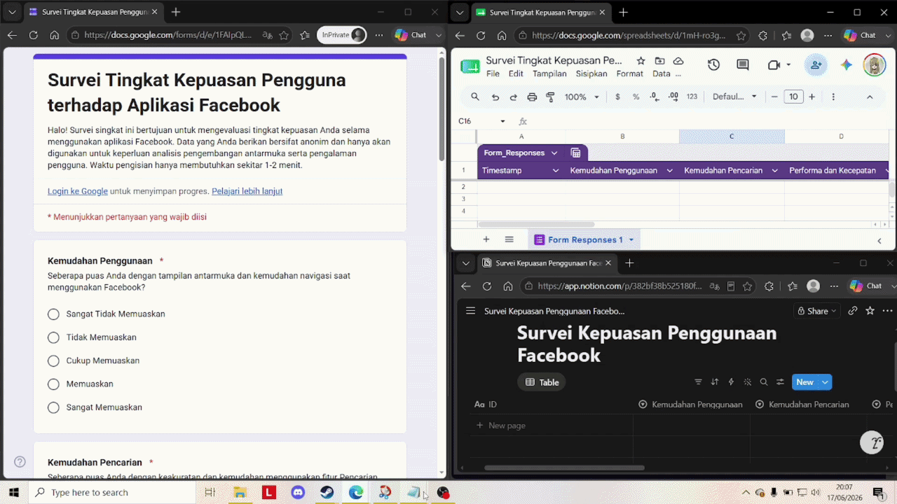

# Serverless-GForm-to-Notion-API-Integration

## Perkenalan Project

Project ini adalah sebuah sistem otomasi aliran data (*data pipeline*) berbasis *serverless* yang dirancang untuk menghubungkan **Google Forms** dan **Google Sheets** langsung ke **Notion Database** secara *real-time*.

## Tech Stack

* **Bahasa Pemrograman:** JavaScript 
* **Environment:** Google Apps Script (GAS)
* **API / Protokol:** Notion API (RESTful HTTP POST), JSON
* **Frontend / Input:** Google Forms
* **Data Landing:** Google Sheets
